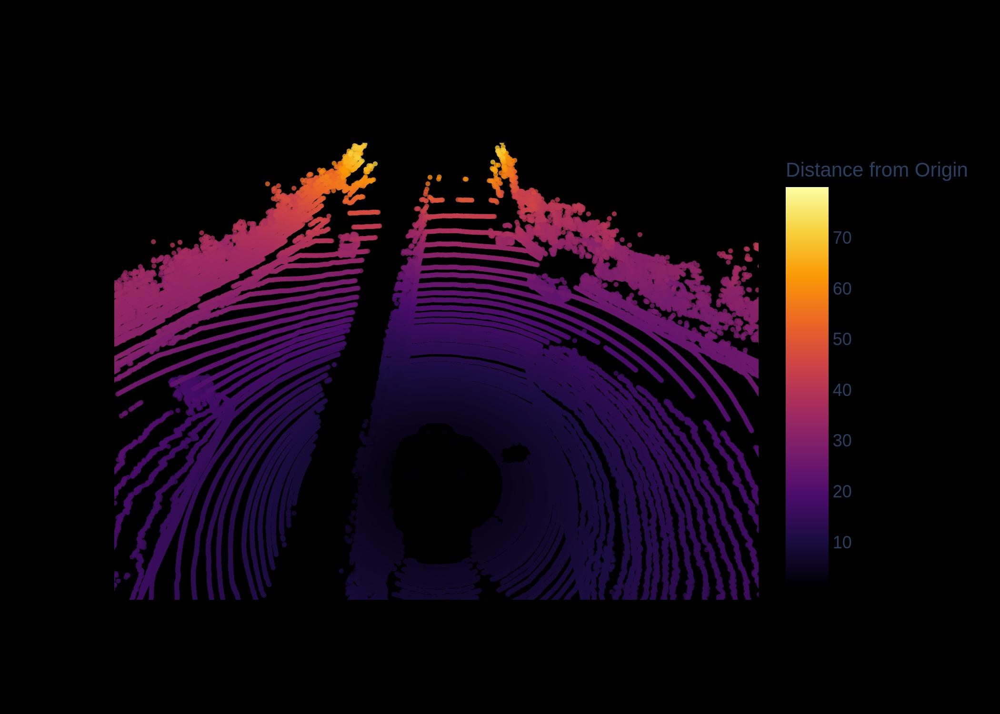
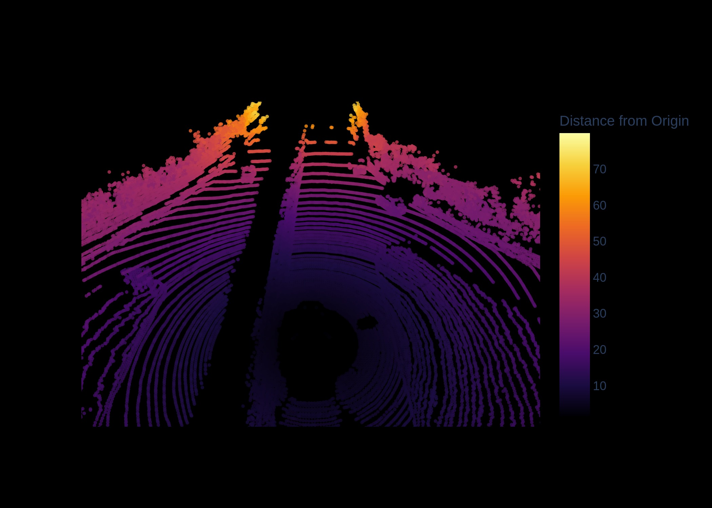
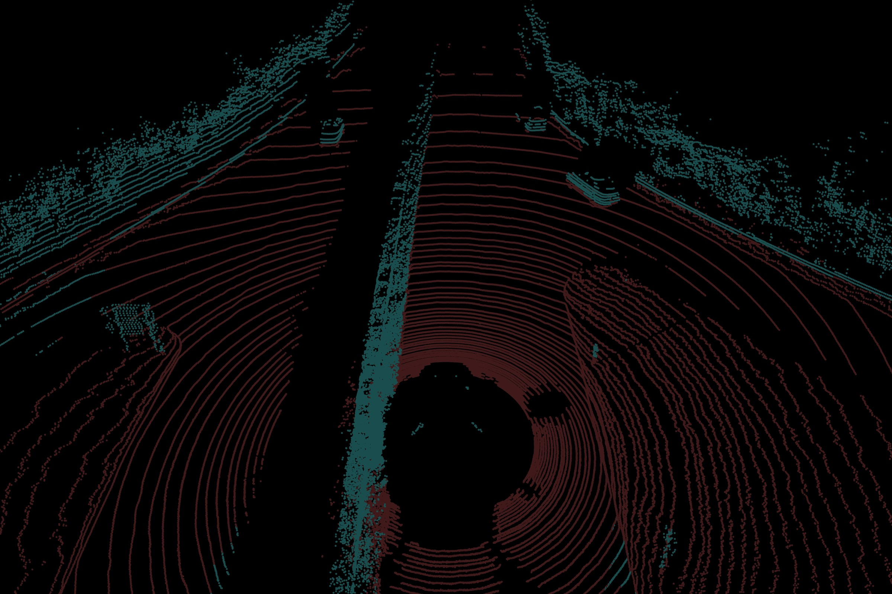
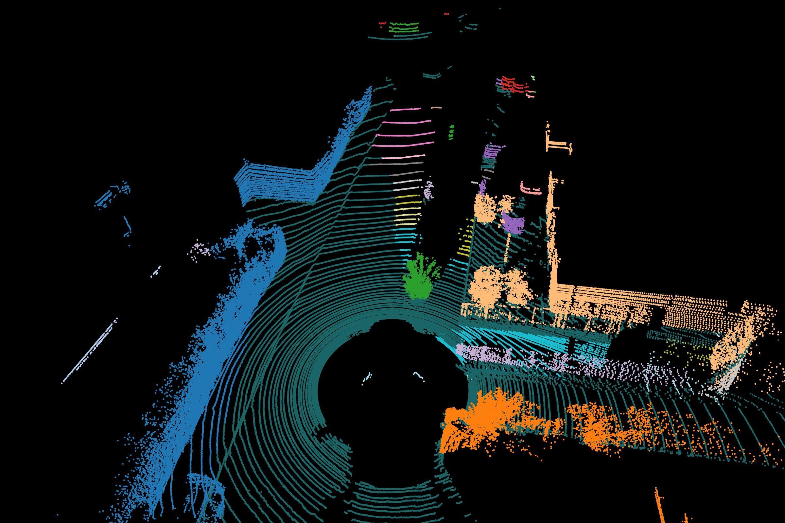
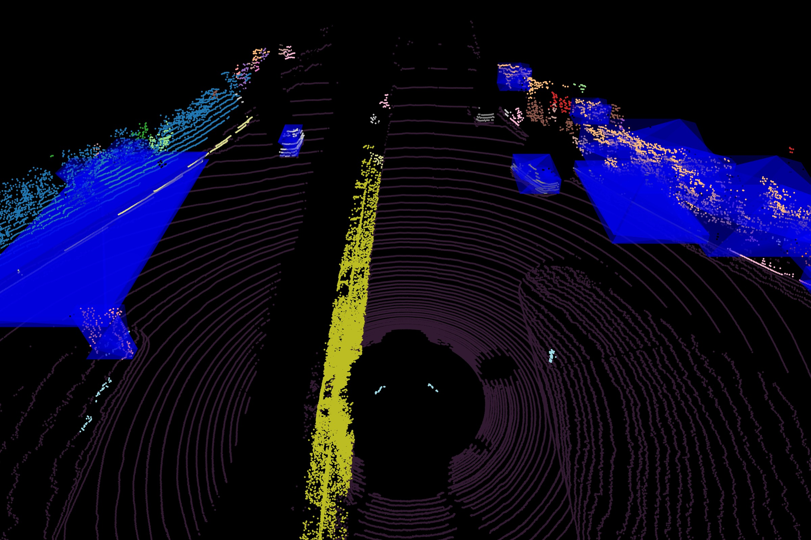

# 3D-Object-detection
In this GitHub project, our objective is to access point cloud data from the Kitti dataset. We will perform various operations and processing tasks on this data, including downsampling, segmentation, and clustering. Ultimately, the project aims to detect objects within the point cloud by employing bounding box techniques.
This project focuses on the segmenting grond and detection of 3D objects from point clouds data from the KITTI dataset, using the built-in functions of Open3d library. The final output is showcased in the following video:

](<YouTube link>)

## About the Dataset
In this project, we make use of the KITTI dataset. To obtain this dataset, simply execute the following commands from your project folder:

```shell
cd data/
wget https://point-clouds-data.s3.us-west-2.amazonaws.com/KITTI_PCD.zip && unzip KITTI_PCD.zip
rm KITTI_PCD.zip
```

You can preview the point cloud data below:



On this pointcloud data, the different point cloud processing operations by Open3d library is applied.

## Downsampling
Voxel downsampling uses a regular voxel grid to create a uniformly downsampled point cloud from an input point cloud. 



## Plane Segmentation
Open3D also supports segmententation of geometric primitives from point clouds using RANSAC. The Open3d function returns the plane as (a,b,c,d) such that for each point (x,y,z) on the plane we have ax+by+cz+d=0.



## DBSCAN Clustering
Given a point cloud from lidar we want to group local point cloud clusters together. For this purpose, we can use clustering algorithms. Open3D implements DBSCAN [Ester1996] that is a density based clustering algorithm. 



## 3D Bounding box
The PointCloud geometry type has bounding volumes as all other geometry types in Open3D. Currently, Open3D implements an AxisAlignedBoundingBox and an OrientedBoundingBox that can also be used to crop the geometry.




## Future Plans
Although the current approach involves some manual intervention, the process can be enhanced through the following strategies:

- KD Tree clustering

### Credits

This project was inspired and guided by Jeremy Cohen's course at Think Autonomous.
